# -1_Hour_Learn_SQL

NEFU数据库实验题。若有版权问题，版权归NEFU。如果侵犯了版权，请及时联系我。这里仅供学习参考。基本可以1小时内学会数据库的操作。

# 一、[数据库SQL的基本操作1：建立表、修改表、删除表、建立索引、删除索引、数据增删改查]

# 1 建立表、修改表、删除表

## 1.1 建立基本表

### 1.1.1 学生表

学生表：Student (Sno, Sname, Ssex, Sdept）其中学号 Sno 主码

```sql
create table Student
(
    Sno int primary key,
    Sname varchar(20),
    Ssex  varchar(2),
    Sdept varchar(4)
);

```

结果：Table STUDENT 已创建。

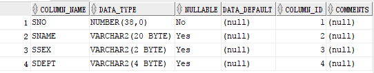

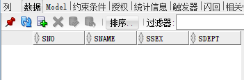

### 1.1.2 课程表

课程表：Course (Cno, Cname, Cpno, Ccredit)其中课程号 Cno 主码；先行课为外码参照 Course 表中 Cno 字段。

```sql
create table Course
(
    Cno int primary key,
    Cname varchar(20),
    Cpno  varchar(4),
    Ccredit int,
    foreign key(Cpno) references Course(Cno)
);
```

结果：Table COURSE 已创建。

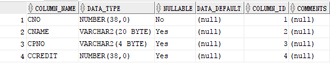

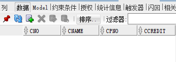

### 1.1.3 学生选课表

学生选课表：SC(Sno, Cno, Grade)其中学号 Sno、课程号 Cno 为主码；Sno 为外码参照 Student 表中 sno 字段；Cno 为外码参照 Course 表中 cno 字段。

```sql
create table SC
(
    Sno int,
    Cno int,
    Grade int,
    primary key(Sno,Cno),
    foreign key(Sno) references Student(Sno),
    foreign key(Cno) references Course(Cno)
);
```

结果：Table SC 已创建。

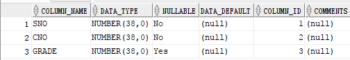

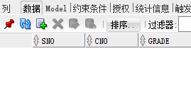

## 1.2 修改基本表

### 1.2.1 在 Student 表中加入属性

在 Student 表中加入属性 Sage（number 型）。

```sql
alter table Student add Sage number(6);
```

结果：Table STUDENT 已变更。

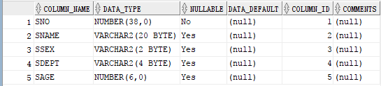

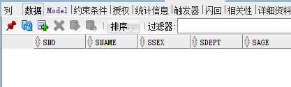

可以看出 Student 表中增加了一列为 Sage。

### 1.2.2 修改某个表的属性的数据类型

```sql
alter table Student modify Sage  varchar(5);
```

结果：Table STUDENT 已变更。

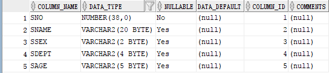

可见 Sage 的数据类型已经变为 varchar(n)型。

## 1.3 删除基本表

### 1.3.1 删除基本表 Student

```sql
drop table Student cascade constraints;
```

结果：Table STUDENT 已删除。

### 1.3.2 删除基本表 SC

```sql
drop table SC cascade constraints;
```

结果：Table SC 已删除。

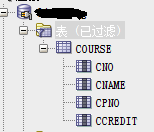

表中仅有 Course 表，Student 表和 SC 表已经被删除。

# 2 建立索引、删除索引

## 2.1 建立索引

### 2.1.1 在 Student 表上建立关于 Sname 的唯一索引 stusnam

```sql
create unique index stusnam on Student(Sname);
```

结果：Index STUSNAM 已创建。

### 2.1.2 在 SC 表上建立关于 Sno 升序、Cno 降序的唯一索引 i_sc

```sql
create unique index i_sc on SC(Sno ASC,Cno DESC);
```

结果：Index I_SC 已创建。

## 2.2 删除索引

### 2.2.1 删除 Student 表上的索引 stusnam

```sql
drop index stusnam;
```

结果：Index STUSNAM 已删除。

### 2.2.2 删除 Course 表上的索引 i_sc

```sql
drop index i_sc;
```

结果：Index I_SC 已删除。

# 3 数据增删改查

## 3.1 增：插入数据

### 3.1.1 向 Student 表中插入数据

```sql
insert into student values  (200215121,'力勇','男','CS',20);
insert into student values  (200215122,'刘晨','女','CS',19);
insert into student values  (200215123,'王敏','女','MA',20);
insert into student values  (200215125,'张立','男','IS',19);
```

结果：
1 行已插入。
1 行已插入。
1 行已插入。
1 行已插入。

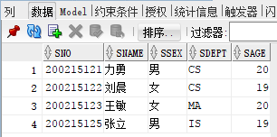

### 3.1.2 向 Course 表中插入数据

```sql
insert into Course values  (1,'数据库','5',4);
insert into Course values  (2,'数学',null,2);
insert into Course values  (3,'信息系统','1',4);
insert into Course values  (4,'操作系统','6',3);
insert into Course values  (5,'数据结构','7',4);
insert into Course values  (6,'数据处理',null,2);
insert into Course values  (7,'PASCAL语言','6',4);
```

结果：
1 行已插入。
1 行已插入。
1 行已插入。
1 行已插入。
1 行已插入。
1 行已插入。
1 行已插入。

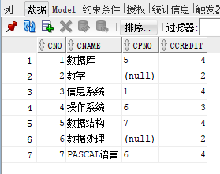

### 3.1.3 向 SC 表中插入数据

```sql
insert into SC values (200215121,1,92);
insert into SC values (200215121,2,85);
insert into SC values (200215121,3,88);
insert into SC values (200215122,4,90);
insert into SC values (200215122,3,80);
```

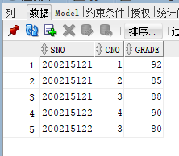

## 3.2 改：修改数据

### 3.2.1 修改 SC 表中学号为 200215121 的同学的成绩为 90

```sql
update SC set Grade=90 where Sno=200215121;
```

结果：
3 行已更新。

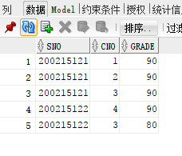

## 3.3 删：删除数据

### 3.3.1 删除 SC 表中学号为 200215121 的学生数据

```sql
delete from SC where Sno=200215121;
```

3 行已删除。

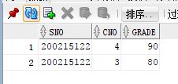

# 4 实战

现有三个表：

**雇员表(emp)**

记录了每个雇员的基本信息

| NO | 字段       | 类型             | 描述            |
|----|----------|----------------|---------------|
| 1  | empno    | Number（4）      | 雇员编号          |
| 2  | ename    | Varchar2\(10\) | 雇员姓名          |
| 3  | job      | Varchar2\(9\)  | 工作职位          |
| 4  | mgr      | Number\(4\)    | 雇员的领导\(经理\)编号 |
| 5  | hierdate | date           | 入职日期          |
| 6  | sal      | Number\(7,2\)  | 月薪/工资         |
| 7  | comm     | Number\(7,2\)  | 奖金            |
| 8  | deptno   | Number\(2\)    | 雇员所属部门的编号     |

**部门表(dept)**

记录了每个部门的基本信息

| NO | 字段     | 类型             | 描述         |
|----|--------|----------------|------------|
| 1  | deptno | Number\(2\)    | 部门编号\(唯一\) |
| 2  | dname  | Varchar2\(14\) | 部门名称       |
| 3  | loc    | Varchar2\(13\) | 地址         |

**工资等级表 (salgrade)**

一个公司的工资等级制，用来表示同一等级的工资下限及上限

| NO | 字段    | 类型     | 描述       |
|----|-------|--------|----------|
| 1  | Grade | number | 等级名称     |
| 2  | Losal | number | 此等级的最低工资 |
| 3  | hisal | number | 此等级的最高工资 |

## 4.1 建立基本表

```sql
create table emp
(
    empno number(4),
    ename varchar(10),
    job varchar(9),
    mgr number(4),
    hierdate date,
    sal number(7,2),
    comm number(7,2),
    deptno number(2)
);
create table dept
(
    deptno number(2) primary key,
    dname varchar(14),
    loc   varchar(13)
);
create table salgrade
(
    Grade number,
    Losal number,
    hisal number
);
```

结果：
Table EMP 已创建。
Table DEPT 已创建。
Table SALGRADE 已创建。

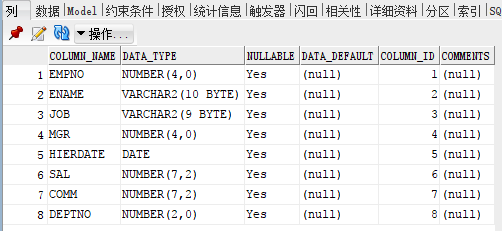

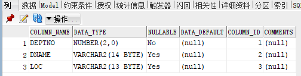

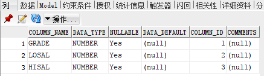

## 4.2 修改基本表

为 emp 表增加新列 adress；修改 dept 表中的 dname 列的宽度,并加入默认值；

```sql
alter table emp add adress char(20);
```

结果：
Table EMP 已变更。

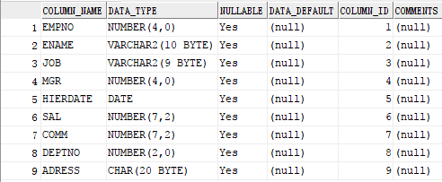

```sql
alter table dept modify dname varchar(20);
```

结果：Table DEPT 已变更。

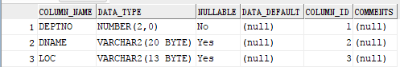

## 4.3 删除基本表

删除基本表 emp；删除基本表 salgrade

```sql
drop table emp cascade constraints;
```

结果：Table EMP 已删除。

```sql
drop table salgrade cascade constraints;
```

结果：Table SALGRADE 已删除。

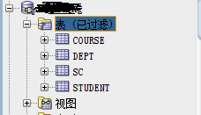

可见，表 emp 和表 salgrade 已经被删除。

## 4.4 索引操作

建立索引：在 emp 表上建立关于 ename 的唯一索引 emp_sname；在 dept 表上建立关于 deptno 升序、dname 降序的唯一索引 e_de

```sql
create unique index emp_sname on emp(ename);
```

结果：Index EMP_SNAME 已创建。

```sql
create unique index e_de on dept(deptno ASC,dname DESC);
```

结果：Index E_DE 已创建。

删除索引：删除 emp 表上的索引 emp_sname；删除 dept 表上的索引 e_de

```sql
drop index emp_sname;
```

结果：Index EMP_SNAME 已删除。

```sql
drop index e_de;
```

结果：Index E_DE 已删除。

## 4.5 数据更新

### 4.5.1 向 dept 表中插入数据；向 emp 表中插入数据；

插入数据：

```sql
insert into emp values (5,'叶良辰','程序员',7,to_date('2017-11-1','YYYY-MM-DD'),12345.55,500.00,1);
```

结果：1 行已插入。

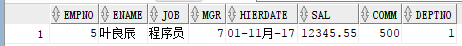

```sql
insert into dept values (1,'生活部','NEFU');
```

结果：1 行已插入。

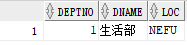

### 4.5.2 修改数据

```sql
update dept set dname='文学部' where deptno=1;
```

结果：1 行已更新。

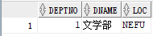

### 4.5.3 删除数据

```sql
delete from dept where deptno=1;
```

结果：1 行已删除。

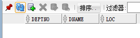

# 5 其他

## 5.1 一个列上有外码约束如何实现

例如，建立表 SC 的外键约束 Sno

```sql
alter table SC
  add constraint fk_Sno
   foreign key (Sno) references S(Sno)
go
```

## 5.2 删除表时，表中某一列是另外一个表的外键，此表如何删除

答：级联删除
例如，删除 Student 表。

```sql
drop table Student cascade constraints;
```

## 5.3 对表中某一列的数据类型进行修改时，要修改的列是否必须为空列

答：是。因为数据类型改变了。如果要修改的列不为空，则数据类型不能改变。

# 二、[数据库SQL的基本操作2：单表查找、多表查找、嵌套查询、视图等]

# 1 已经创建的 SQL 数据表

Student 表：

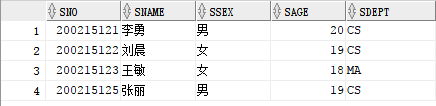

Course 表：


SC 表：

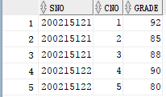

# 2 单表查询操作

### 2.1 求数学系学生的学号和姓名

```sql
select Sno,Sname from Student where Sdept='MA';
```

结果：

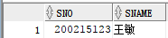

### 2.2 求选修了课程的学生学号

```sql
select Sno from SC where Cno is not null;
```

结果：

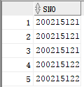

### 2.3 求选修课程号为‘2’的学生号和成绩

```sql
select Sno,Grade from SC where Cno=2;
```

结果：

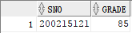

### 2.4 求选修课程号为’2’且成绩在 80 ～ 90 之间的学生学号和成绩，并将成绩乘以 0.8 输出

```sql
select Sno,Grade*0.8 from SC where Cno=2 and Grade>=80 and Grade<=90;
```

结果：

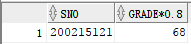

### 2.5 求数学系或计算机系姓张的学生的信息

```sql
select * from Student where Sname like '张%' and (Sdept='CS' or Sdept='MA');
```

结果：

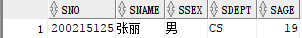

### 2.6 求缺少了成绩的学生的学号和课程号

```sql
select SC.Sno,SC.Cno from SC where SC.Grade=null;
```

结果：

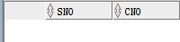

### 2.7 查询各个课程号与相应的选课人数

```sql
select SC.Cno,COUNT(Cno) from SC Group by Cno;
```

结果：

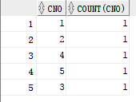

# 3 多表查询操作

### 3.1 查询每个学生的情况以及他所选修的课程

```sql
select * from Student left join SC on Student.Sno=Sc.Sno;
```

结果：

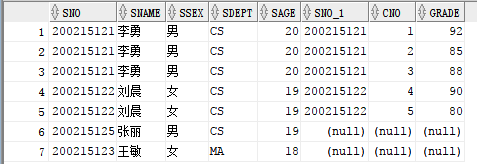

### 3.2 求学生的学号、姓名、选修的课程及成绩

```sql
select Student.Sno,Student.Sname,SC.Cno,SC.Grade from Student left join SC on Student.Sno=Sc.Sno;
```

结果：


### 3.3 求选修课程号为‘1’且成绩在 90 分以上的学生学号、姓名和成绩。

```sql
select Student.Sno,Student.Sname,SC.Grade from Student join SC on Student.Sno=Sc.Sno where SC.CNO=1 and SC.GRADE>90;
```

结果：

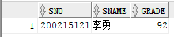

### 3.4 查询每一门课程的间接先行课

```sql
select c1.Cname,c3.Cname from Course c1,Course c2,Course c3 where c1.Cpno=c2.Cno and c2.Cpno=c3.cno;
```

结果：

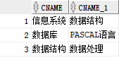

### 3.5 查询与’刘晨’在同一个系学习的学生

```sql
select s1.Sname from Student s1,Student s2 where s1.Sdept=s2.Sdept and s2.Sname='刘晨';
```

结果：

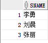

### 3.6 查询选修了课程名为‘信息系统’的学生学号和姓名

```sql
select Student.Sno,Student.Sname from Student,Course,SC where Student.Sno=SC.Sno and SC.Cno=Course.Cno and Course.CNAME='信息系统';
```

结果：

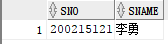

### 3.7 查询平均成绩在 80 分以上的学生学号和平均成绩

```sql
select Sno,Avg(Grade) from SC group by Sno having Avg(Grade)>80;
```

结果：

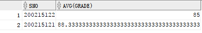

### 3.8 查询选修了 1 门以上课程的学生的学号

```sql
select Sno from SC group by Sno having count(Cno)>1;
```

结果：

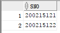

### 3.9 写一个外查询的语句

```sql
select SC.Sno,Student.Sname,SC.Cno,Sc.Grade from  Student,SC where STUDENT.SNO=SC.SNO;
```

结果：

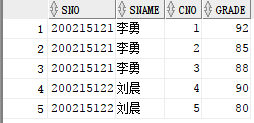

# 4 嵌套查询

### 4.1 求选修了信息系统的学号和姓名

```sql
select Student.Sno,Student.Sname from Student join SC on Student.SNO = SC.SNO where Cno=(select Cno from Course where Cno=3);
```

结果：

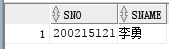

### 4.2 查询与刘晨在同一个系学习的学生

```sql
select * from Student where Sdept=(select Sdept from Student where Sname='刘晨');
```

结果：

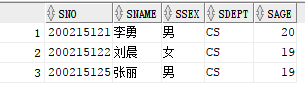

### 4.3 3. 求选修 1 号课程的成绩高于刘晨的成绩（指刘晨选修的所有的课程的成绩）的学生学号及成绩

```sql
select Student.Sno,SC.Grade from Student join SC on Student.SNO = SC.SNO where SC.Grade>
(select MAX(SC.Grade) from Student join SC on Student.SNO = SC.SNO where SC.SNO=Student.SNO and Student.SNAME='刘晨');
```

结果：

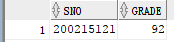

### 4.4 求其他系中比计算机系某一学生年龄小的学生（即年龄小于计算机系年龄最大者的学生）

```sql
select * from Student where SAGE<(select MAX(Sage) from Student);
```

结果：

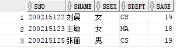

### 4.5 求其他系中比计算机系学生年龄都小的学生姓名及年龄

```sql
select * from Student where SAGE<(select MIN(Sage) from Student where Sdept='CS');
```

结果：

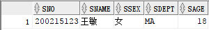

### 4.6 求没有选修 3 号课程的学生姓名

```sql
select Sno,Sname from Student where Sno in (select Sno from SC where Cno!=3);
```

结果：

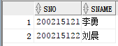

### 4.7 查询选修了全部课程的学生姓名

```sql
select Sno,Sname from student where Sno IN (select Sno from SC group by Sno having count(*)=(select count(*) from course ));
```

结果：

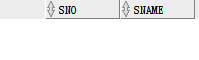

### 4.8 求至少选修了学号为“20021522”的学生所选修全部课程的学生学号和姓名

```sql
select Sno,Sname from Student where Sno in(select Sno from SC where Cno in (select Cno from SC where Sno=200215122));
```

结果：

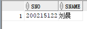

### 4.9 求选修课程超过 2 门的学生的学号和姓名

```sql
select Sno,Sname from Student where Sno in(select Sno from SC group by Sno having count(Cno)>2);
```

结果：


# 5 带子查询的修改语句

### 5.1 将计算机科学系全体学生的成绩置零

```sql
update SC set Grade=0 where Sno in(select Sno from Student where Sdept='CS');
```

结果：5 行已更新。


# 6 视图

### 6.1 建立信息系学生的视图

```sql
create view stu_info
as
select * from Student where SDEPT='CS';
```

结果：View STU_INFO 已创建。

### 6.2 （在视图上建立）建立信息系选修了 1 号课程的学生的视图

```sql
create view stu_course_1
as
select * from STU_INFO where Sno in(select Sno from SC where Cno=1);
```

结果：View STU_COURSE_1 已创建。

### 6.3 将学生的学号及其平均成绩定义为一个视图

```sql
create view sno_and_avggrade
as
select Sno,avg(Grade)AVG_GRADE from SC group by Sno;
```

结果：View SNO_AND_AVGGRADE 已创建。

### 6.4 将 Student 表中所有女生记录定义为一个视图 m_stu（sno，sname，dept），并设置其更新限制

```sql
create view m_stu
as
select Sno,Sname,Sdept from Student;
```

结果：View M_STU 已创建。

### 6.5 对 4 中的视图进行 insert，update，delete 操作观察其执行情况

```sql
    insert into m_stu values(200215129,'李百','CS');
```

结果：1 行已插入。

```sql
update m_stu set Sno=123456789 where Sno=200215129;
```

结果：1 行已更新。

```sql
delete from  m_stu where Sno=123456789;
```

结果：1 行已删除。

# 7 其他

### 7.1 Where 子句中能否用聚集函数作为条件表达式。

答：不能。Where 是条件语句，后面应该跟着的是条件。

### 7.2 多表连接查询中如果显示的某一属性不止一个表中出现，应如何处理。

答：将多个表进行连接。

### 7.3 在嵌套查询中，什么情况下用“IN”和“＝”都可以。

答：当 in 后面的子查询语句只返回一行的时候，“IN”和“＝”都可以。


# 三、[数据库SQL的基本操作3：模糊查询、oracle的安全性和完整性控制]

## 1 用户 std01 把查询 Student 表权限授给用户 std02，std02 执行相应的查询

```sql
create user Student02 IDENTIFIED by sxsfyswhc123;
grant connect to Student02;
```

结果：
User STUDENT02 已创建。Grant 成功。

```sql
grant select on Student to Student02;
grant select on Course to Student02;
```

结果：
Grant 成功。Grant 成功。
用 Student02 用户登录，登录成功。

### 1.1 查询 std01 用户的全体学生的详细记录

```sql
select * from STD_4132.STUDENT;
```

结果：


### 1.2 查询 std01 用户的年龄不在 20 至 23 岁之间的学生姓名、系别和年龄

```sql
select sname,sdept,sage from STD_4132.student where sage not between 20 and 23;
```

结果：


### 1.3 查询 std01 用户的所有姓刘的学生的姓名、学号和性别

```sql
select sname,sno,ssex from STD_4132.student where sname like '刘%';
```

结果：


### 1.4 查询 std01 用户的名字中第二字为“阳”字的学生的姓名和学号

```sql
select sname,sno,ssex from STD_4132.student where sname like '_阳%';
```

结果：


## 2 std01 把对 Student 表和 Course 表的全部权限授予用户 std02 ，std02 修改 std01 的数据

```sql
Grant all privileges on course to Student02;
Grant all privileges on student to Student02;
```

结果：
Grant 成功。Grant 成功。

```sql
update  STD_4132.STUDENT set SSEX='女' where SNAME='李勇';
```

结果：1 行已更新。

## 3 std01 把对表 SC 的查询权限授予所有用户

```sql
Grant select on SC to public;
```

结果：
Grant 成功。

### 3.1 查询选修了 3 号课程的学生的学号及其成绩，查询结果按分数的降序排列

```sql
select sno,grade from STD_4132.SC where cno=3 order by grade desc;
```

结果：


### 3.2 查询各个课程号与相应的选课人数

```sql
select cno,count(cno) from STD_4132.SC group by cno;
```

结果：


## 4 用户 std01 把 Student 表和修改学生学号的权限授给用户 std02

```sql
grant update(Sno) on Student to Student02;
```

结果:
Grant 成功。

## 5 从用户 std02 把授予出的的权限一一收回

```sql
revoke all on Student from Student02;
revoke all on SC from Student02;
revoke all on Course from Student02;
```

结果:
Revoke 成功。Revoke 成功。Revoke 成功。

### 5.1 建立部门表 DEPT，要求部门名称 Dname 列值取值唯一，部门编号 Depno 列为主码

```sql
Create table DEPT
(
    Deptno char(7)
    constraint PK_dept primary key,
    dname char(20) unique
);
```

结果：
Table DEPT 已创建。

### 5.2 建立学生登记表 student，要求学号在 900000 至 999999 之间，年龄<29,，性别只能是'男'或'女'，姓名非空

```sql
Create table S
(
    Sno number constraint PK_s check (sno between 900000 and 999999),
    Sname char(20) not null,
    Ssex char(2),
    Sage number,
    Constraint ck_sex check (Ssex in ('男','女')),
    Constraint ck_sage check (Sage<29)
);
```

结果：
Table S 已创建。

### 5.3 建立职工表 EMP，要求每个职工的应发工资不得超过 3000 元。应发工资实际上就是实际发工资列 Sal 与扣除项 Deduct 之和

```sql
Create table EMP
(
    a1 number,
    Sal number,
    Deduct number,
    constraint PK_s9 check (a1<3000 )
);
```

结果：
Table EMP 已创建。

## 6 修改学生成绩数据库的 3 个表的定义，分别为每个表建立主码和外码，并输入数据，验证实体完整性和参照完整性

对 DEPT 表的操作：

```sql
alter table DEPT drop primary key;
alter table DEPT add constraint PK_dept primary key (Deptno);
```

结果：
Table DEPT 已变更。
Table DEPT 已变更。
输入数据：

```sql
insert into DEPT values ('1','产品部门');
```

结果：
1 行已插入。


对 S 表的操作：

```sql
alter table Student add constraint FK_Student_S  foreign key (Sno) references Student(Sno) ;
```

结果：
Table STUDENT 已变更。
输入数据：

```sql
insert into S values (200215121,'陈旭','女',20);
```

结果：
错误报告 -
ORA-02290: 违反检查约束条件 (STD_4132.PK_S)

对 EMP 表的操作：

```sql
alter table EMP add constraint PK_EMP primary key (Sal);
```

结果：
Table EMP 已变更。
输入数据：

```sql
insert into EMP values(100,200,300);
```

结果：
1 行已插入。


## 7 对上述新建立和修改定义的表，每个表输入 3 条数据，其中 1 条数据符合完整性约束，2 条违反约束条件的，验证和体会 Oracle 完整性

```sql
insert into DEPT values ('2','管理部门');
```

结果：
1 行已插入。

```sql
insert into DEPT values ('2','生活部门');
```

结果：
错误报告 -
ORA-00001: 违反唯一约束条件 (STD_4132.PK_DEPT)

```sql
insert into DEPT values ('1','财务处');
```

错误报告 -
ORA-00001: 违反唯一约束条件 (STD_4132.PK_DEPT)

```sql
insert into S values (900005,'赫伦','女',20);
```

结果：
1 行已插入。

```sql
insert into S values (9005,'里伦','女',30);
```

结果：
错误报告 -
ORA-02290: 违反检查约束条件 (STD_4132.CK_SAGE)

```sql
insert into S values (20125,'山大','男',30);
```

结果：
错误报告 -
ORA-02290: 违反检查约束条件 (STD_4132.CK_SAGE)

```sql
insert into EMP values(20,30,1);
```

结果：
1 行已插入。

```sql
insert into EMP values(200,200000,30);
```

结果：
错误报告 -
ORA-01438: 值大于为此列指定的允许精度

```sql
insert into EMP values(200,30,3);
```

结果：
错误报告 -
ORA-02291: 违反完整约束条件 (STD_4132.SYS_C0013788) - 未找到父项关键字

## 8 其他

### 查看表的字段信息

desc 表名;

### 查看表的所有信息

show create table 表名;

### 添加主键约束

alter table 表名 add constraint 主键 （形如：PK\_表名） primary key 表名(主键字段);

### 添加外键约束

alter table 从表 add constraint 外键（形如：FK*从表*主表） foreign key 从表(外键字段) references 主表(主键字段);

### 删除主键约束

alter table 表名 drop primary key;

### 删除外键约束

alter table 表名 drop foreign key 外键（区分大小写）;
